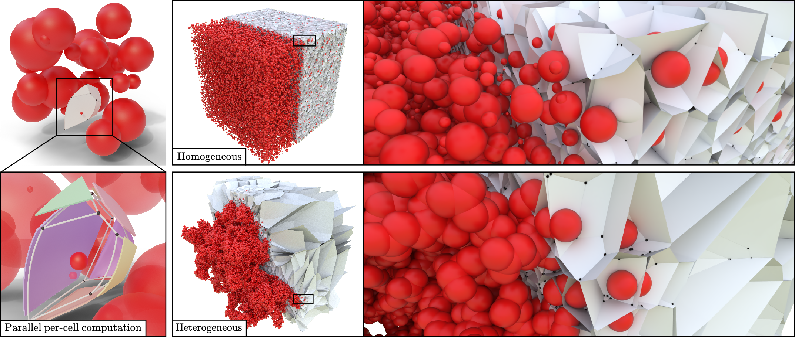

<p align="center">
  <h1 align="center">In Search of Empty Spheres: 3D Apollonius Diagrams on GPU</h1>
  <a href="">
    
  </a>
  </p>
</p>

</br>
<details open="open">
  <summary>Table of Contents</summary>
  <ol>
    <li>
      <a href="#requirements">Requirements</a>
    </li>
    <li>
      <a href="#build">Build</a>
    </li>
    <li>
      <a href="#experiments">Experiments</a>
    </li>
  </ol>
</details>

This project hosts the reference implementation of our article "In Search of Empty Spheres: 3D Apollonius Diagrams on GPU".

It provides the implementation of our cell update method abd multiple spatial search allowing to find contributing sites based on an LBVH (which implementation is heavily based on [1]). 

If you use this code, please cite the following paper:
```bibtex
@article{PlateauHolleville2025,
    author={Plateau--Holleville, C. and Stamm, B. and Nivoliers, V. and Maria, M. and Mérillou, S.},
    journal={ACM Transactions on Graphics}, 
    title={In Search of Empty Spheres: 3D Apollonius Diagrams on GPU}, 
    year={2025},
    volume={44},
    number={4},
    pages={1--15}
}
```

## Requirements

Our implementation has been tested on Windows and Linux and is based on C++17, CMake (tested with 3.30), OpenMP and CUDA 12.
Additionally, we rely on OptiX 8 and Cupti for some experiments. `OptiX_DIR` must then be set to the root of the installation folder.

## Build

The project can be compiled on Windows with the execution of the following command in the root folder of the project:
```shell
mkdir out
cmake -S . -B out
cmake --build out --config "Release"
```

And on Linux with:
```shell
mkdir out
cmake -S . -B out -DCMAKE_BUILD_TYPE=Release
cmake --build out
```

## Experiments

We provide several targets reproducing article results:
- `statistics-apovsvoronota-*`: Comparison between Voronota and our method on several datasets.
- `statistics-benchmark-*`: Multiple studies of our method.
- `precision-*`: Extract and validate the geometrical components of the computed diagram using interval arithmetic.
- `topology-*`: Extract the combinatorial structure of our method and previous works for comparison.
- `memory`: Compute the peak memory consumption of the algorithm.

The project also presents two targets allowing the visualization of the diagram's vertices:
- `visualization`: Visualize an input set and the computed Apollonius vertices.
- `cavity-detection-gpu`: Visualize an input set, the computed Apollonius vertices and filter the vertices based on their visibility and radius.

Note that all statistics executables produce `.csv` files which can be processed to produce the paper's figures.

We also rely on the dataset presented by [2] to evaluate the robustness of Apollonius computation method.

## References

[1] - `D. Meister, & J. Bittner (2022). Performance Comparison of Bounding Volume Hierarchies for GPU Ray Tracing. Journal of Computer Graphics Techniques, 11(4), 1–19.`

[2] - `C. Song, M. Lee, S. Choi, & D.-S. Kim (2022). Benchmark dataset for the Voronoi diagram of 3D spherical balls. Data in Brief, 45, 108605.`